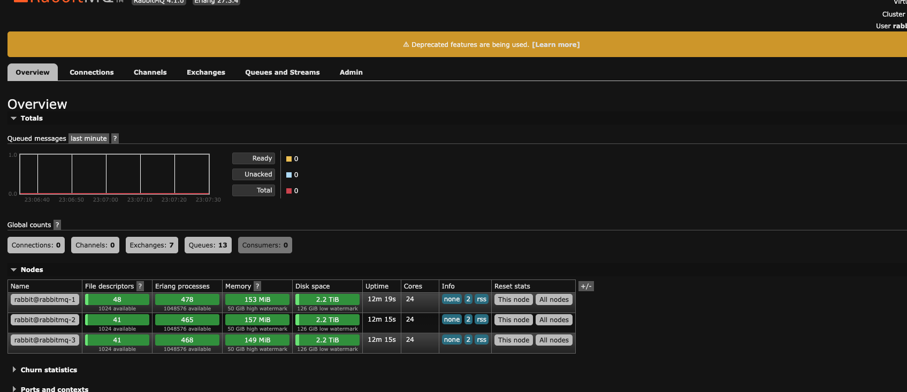

# Docker Deployment Guide: Hyperion & Atomic Services

> Quick deployment solution for Hyperion and Atomic services with monitoring capabilities.

## 🚀 Quick Start

1. Clone and navigate to the project
2. Configure your `.env` file (see [Environment Setup](#-environment-setup))
3. Run the Python script to generate the docker compose files:
```bash
# Generate Hyperion compose file            
python3 generate_hyperion_compose.py

# Generate Atomic compose file
python3 generate_atomic_compose.py
```
4. Run the desired service:
```bash
# For Hyperion
docker-compose -f ./docker-compose-generated-hyperion.yml up -d --build

# For Atomic
docker-compose -f ./docker-compose-generated-atomic.yml up -d --build
```
5. Stop the services:
```bash
# For Hyperion
docker-compose -f ./docker-compose-generated-hyperion.yml down

# For Atomic
docker-compose -f ./docker-compose-generated-atomic.yml down
``` 

## 📋 Services Overview

| Service | Purpose | Default Port | Stack |
|---------|---------|--------------|-------|
| Hyperion | History API & Indexer | 7000 | Hyperion |
| Elasticsearch | Search & Storage | 9200 | Hyperion |
| Kibana | Data Visualization | 5601 | Hyperion |
| RabbitMQ | Message Queue | 5672, 15672 | Hyperion |
| Redis | Caching Layer | 6379 | Both |
| Atomic API | NFT Data Provider | 28888 | Atomic |
| PostgreSQL | Database | 5432 | Atomic |
| Grafana | Metrics Dashboard | 3000 | Both |
| Prometheus | Metrics Collection | 9090 | Both |
| ES Exporters | Elasticsearch Metrics | 9114+ | Hyperion |

## 📋 Prerequisites

- Docker & Docker Compose
- Elasticsearch configuration:
```bash
# Set vm.max_map_count
echo "vm.max_map_count=262144" >> /etc/sysctl.conf
sudo sysctl -p
```

## 🔧 Environment Setup

<details>
<summary><b>Sample .env Configuration</b></summary>

```env
# Hyperion Settings
ELASTICSEARCH_VERSION=8.13.2
KIBANA_VERSION=8.13.2
RABBITMQ_DEFAULT_USER=rabbitmquser
RABBITMQ_DEFAULT_PASS=rabbitmqpass
RABBITMQ_DEFAULT_VHOST=hyperion
HYPERION_ENVIRONMENT=testnet
HYPERION_LAUNCH_ON_STARTUP=false
HYPERION_VERSION=3.5.0
ELASTIC_MAX_MEM=15g
ELASTIC_MIN_MEM=15g
AMOUNT_OF_NODE_INSTANCES=2

# Resource constraints
REDIS_MEMORY=2g
REDIS_CPUS=1
RABBITMQ_MEMORY=2g
RABBITMQ_CPUS=1
HYPERION_MEMORY=8g
HYPERION_CPUS=2
NODE_MEMORY=16g
NODE_CPUS=4
KIBANA_MEMORY=2g
KIBANA_CPUS=1
PROMETHEUS_MEMORY=2g
PROMETHEUS_CPUS=1
GRAFANA_MEMORY=1g
GRAFANA_CPUS=1

# Atomic Settings
SHIPHOST=172.168.40.50
SHIPPORT=29876
HTTPHOST=172.168.40.50
HTTPPORT=28888
POSTGRES_USER=waxuser
POSTGRES_PASSWORD=waxuserpass
POSTGRES_DB=atomic
ATOMIC_ENVIRONMENT=testnet
ATOMIC_LAUNCH_ON_STARTUP=true

# Leap variables for Hyperion
LEAP_FILE=https://apt.eossweden.org/wax/pool/stable/w/wax-leap-503wax01/wax-leap-503wax01_5.0.3wax01-ubuntu-22.04_amd64.deb
LEAP_DEB_FILE=wax-leap-503wax01_5.0.3wax01-ubuntu-22.04_amd64.deb

# Grafana settings
GF_USERNAME=admin
GF_PASSWORD=admin123

# Elasticsearch settings
ES_HEAP_DUMP_PATH=/var/log/elasticsearch
ES_GC_LOG_PATH=/var/log/elasticsearch
ES_JAVA_OPTS="-XX:+HeapDumpOnOutOfMemoryError -XX:HeapDumpPath=${ES_HEAP_DUMP_PATH}"

# Monitoring configuration
MONITORING_ENABLED=true
```
</details>

## 🏗️ Architecture

### Hyperion Stack
- **Search & Analytics**: Elasticsearch cluster (configurable nodes)
- **Visualization**: Kibana
- **Caching**: Redis
- **Message Queue**: RabbitMQ
- **Monitoring**: Grafana + Prometheus
- **Custom Exporters**: Nodeos, RabbitMQ, Redis

### Atomic Stack
- **Database**: PostgreSQL (optimized configuration)
- **Caching**: Redis
- **Monitoring**: Grafana + Prometheus
- **Custom Exporters**: PostgreSQL, Redis

## 🛠️ Advanced Configuration

### Resource Constraints
You can customize the memory and CPU limits for each service through environment variables:

```env
# Memory and CPU limits for services
REDIS_MEMORY=2g
REDIS_CPUS=1
RABBITMQ_MEMORY=2g
RABBITMQ_CPUS=1
HYPERION_MEMORY=8g
HYPERION_CPUS=2
NODE_MEMORY=16g
NODE_CPUS=4
KIBANA_MEMORY=2g
KIBANA_CPUS=1
PROMETHEUS_MEMORY=2g
PROMETHEUS_CPUS=1
GRAFANA_MEMORY=1g
GRAFANA_CPUS=1
```

These constraints are applied to the Docker containers using the `deploy.resources.limits` configuration. You can verify the applied constraints using:

```bash
docker inspect <container_name> | grep -A 10 "HostConfig"
```

For example, to check Redis resource constraints:
```bash
docker inspect redis | grep -A 10 "HostConfig"
```

This will show the memory limit in bytes (e.g., 2147483648 for 2GB) and CPU limit in nanoseconds (e.g., 1000000000 for 1 CPU).

### Monitoring Toggle
You can enable or disable the monitoring stack (Prometheus, Grafana, and all exporters) by setting the `MONITORING_ENABLED` variable in your `.env` file:

```env
# Enable monitoring (default)
MONITORING_ENABLED=true

# Disable monitoring
MONITORING_ENABLED=false
```

When monitoring is disabled:
- Prometheus and Grafana containers will not be included in the compose file
- All exporters (Elasticsearch, Redis, RabbitMQ, Nodeos) will be excluded
- Prometheus configuration will not be updated
- Grafana data volume will not be created

This feature is useful for:
- Development environments where monitoring is not needed
- Resource-constrained systems
- Simplified deployments for testing
- Production environments where monitoring is handled separately

### Elasticsearch Configuration
The deployment automatically manages Elasticsearch configuration through `elasticsearch.yml` files. Each Elasticsearch node gets its own optimized configuration with the following settings:

```yaml
# Memory settings
indices.memory.index_buffer_size: 30%
indices.fielddata.cache.size: 25%
indices.queries.cache.size: 25%

# Thread pool settings
thread_pool:
  write:
    size: 8
    queue_size: 1000
  search:
    size: 12
    queue_size: 1000

# Recovery settings
indices.recovery.max_bytes_per_sec: 500mb
indices.recovery.max_concurrent_file_chunks: 8

# Cache and disk settings
cache.recycler.page.type: NONE
cluster.routing.allocation.disk.threshold_enabled: false
http.max_content_length: 500mb
```

These configurations are automatically generated and placed in:
```
elasticsearch/config/es{n}/elasticsearch.yml
```
Where `{n}` represents the node number (e.g., es1, es2, etc.)

#### Customizing Elasticsearch Configuration
To modify the default Elasticsearch settings:

1. Locate the `generate_elasticsearch_config()` function in `generate_hyperion_compose.py`:
```python
def generate_elasticsearch_config():
    return """
    # Memory settings
    indices.memory.index_buffer_size: 30%
    ...
    """
```

2. Edit the configuration string in this function to match your desired settings
3. Run the generation script again:
```bash
python3 generate_hyperion_compose.py
```

Common modifications include:
- Adjusting memory settings for different hardware configurations
- Modifying thread pool sizes for different workloads
- Changing recovery settings for network optimization
- Updating cache settings for memory management

> Note: Make sure to back up your configuration changes as they will be overwritten if you update the repository.

### Custom Elasticsearch Cluster
```bash
# Set desired node count in .env
AMOUNT_OF_NODE_INSTANCES=2
```

When you modify the `AMOUNT_OF_NODE_INSTANCES` in your `.env` file and run `generate_hyperion_compose.py`:
1. The script will generate the appropriate number of Elasticsearch nodes
2. It will create optimized elasticsearch.yml configurations for each node
3. It will automatically create corresponding Elasticsearch exporters (one per ES node)
4. The Prometheus configuration (`prometheus/hyperion/prometheus.yml`) will be dynamically updated to monitor all ES instances
5. Each ES exporter will be assigned a unique port starting from 9114 (e.g., 9114, 9115, etc.)

For example, with `AMOUNT_OF_NODE_INSTANCES=2`:
- ES Node 1 → elasticsearch-exporter-1:9114
- ES Node 2 → elasticsearch-exporter-2:9115

### PostgreSQL Optimizations
The PostgreSQL instance is automatically configured with performance optimizations based on the host system's resources:

- **shared_buffers**: Set to 25% of total system memory
- **work_mem**: Calculated based on max_connections and available memory
- **maintenance_work_mem**: Set to 5% of total system memory
- **effective_cache_size**: Set to 50% of total system memory
- **Extensions**: Automatically enables pg_trgm for improved text search capabilities

These optimizations are handled automatically during container initialization through the init-db.sh script.

## 📈 Recent Improvements

<details>
<summary><b>View Changelog</b></summary>

| Date | Improvement | Impact |
|------|------------|---------|
| 2025-04-01 | Added HAProxy reverse proxy with host-based routing | Security & Flexibility |
| 2025-03-08 | Added resource constraints for all services | Performance & Stability |
| 2025-03-07 | Added monitoring toggle feature | Resource Optimization |
| 2025-01-02 | Added automated Elasticsearch configuration management | Performance |
| 2025-01-01 | Added healthcheck to Elasticsearch | Monitoring |
| 2025-01-01 | Added ES heap dump and GC logging configuration | Debugging |
| 2024-12-24 | Added dynamic Prometheus configuration for ES exporters | Monitoring |
| 2024-12-23 | Added Atomic monitoring (Postgres/Redis) + managed Grafana dashboards | Monitoring |
| 2024-12-23 | Added Hyperion monitoring (RabbitMQ/Redis) + managed Grafana dashboards | Monitoring |
| 2024-12-22 | Custom built exporters for nodeos + managed Grafana dashboards | Monitoring |
| 2024-11-20 | Scripted docker compose generation | Usability |
| 2024-07-14 | Customizable nodeos deployment | Flexibility |
| 2024-07-13 | Hyperion 3.3.10-1 verification | Stability |
| 2024-06-20 | Improved error handling and logging | Reliability |
| 2024-05-10 | Added automated backup solutions | Data Safety |
| 2024-04-15 | Enhanced security with localhost port binding | Security |

</details>

## 🔍 Troubleshooting

- Check container logs: `docker logs <container_name>`
- Ensure no port conflicts
- Verify environment variables are set correctly
- Confirm data volumes are properly mounted
- Verify resource constraints: `docker inspect <container_name> | grep -A 10 "HostConfig"`

## 📚 Documentation

<details>
<summary><b>Environment Variables Reference</b></summary>

### Hyperion Variables
- `ELASTICSEARCH_VERSION`: Specifies the version of Elasticsearch to be used in the services
- `KIBANA_VERSION`: Defines the version of Kibana for compatibility with Elasticsearch
- `HYPERION_VERSION`: Configure Hyperion Version deployment
- `ELASTIC_MAX_MEM`/`ELASTIC_MIN_MEM`: ES memory limits
- `ES_HEAP_DUMP_PATH`: Directory path for Elasticsearch heap dumps (default: /var/log/elasticsearch)
- `ES_GC_LOG_PATH`: Directory path for Elasticsearch garbage collection logs (default: /var/log/elasticsearch)
- `ES_JAVA_OPTS`: Java options for Elasticsearch, including heap dump settings
- `RABBITMQ_DEFAULT_USER`: The default username for RabbitMQ access
- `RABBITMQ_DEFAULT_PASS`: The default password for RabbitMQ access
- `RABBITMQ_DEFAULT_VHOST`: The default virtual host in RabbitMQ, used for isolation and management of queues
- `HYPERION_ENVIRONMENT`: Hyperion environment
- `HYPERION_LAUNCH_ON_STARTUP`: Hyperion startup at launchtime (Ship + Hyperion indexer)
- `AMOUNT_OF_NODE_INSTANCES`: The amount of ES instances you would like to have part of your Elasticsearch solution

### Resource Constraint Variables
- `REDIS_MEMORY`: Memory limit for Redis (default: 2g)
- `REDIS_CPUS`: CPU limit for Redis (default: 1)
- `RABBITMQ_MEMORY`: Memory limit for RabbitMQ (default: 2g)
- `RABBITMQ_CPUS`: CPU limit for RabbitMQ (default: 1)
- `HYPERION_MEMORY`: Memory limit for Hyperion (default: 8g)
- `HYPERION_CPUS`: CPU limit for Hyperion (default: 2)
- `NODE_MEMORY`: Memory limit for Node (default: 16g)
- `NODE_CPUS`: CPU limit for Node (default: 4)
- `KIBANA_MEMORY`: Memory limit for Kibana (default: 2g)
- `KIBANA_CPUS`: CPU limit for Kibana (default: 1)
- `PROMETHEUS_MEMORY`: Memory limit for Prometheus (default: 2g)
- `PROMETHEUS_CPUS`: CPU limit for Prometheus (default: 1)
- `GRAFANA_MEMORY`: Memory limit for Grafana (default: 1g)
- `GRAFANA_CPUS`: CPU limit for Grafana (default: 1)

### Atomic Variables
-  `SHIPHOST`: WS connection to your full SHIP
-  `SHIPPORT`: WS port to your full SHIP
-  `HTTPHOST`: HTTP connection to your full SHIP
-  `HTTPPORT`: HTTP port to your full SHIP
-  `POSTGRES_USER`: User for Atomic DB
-  `POSTGRES_PASSWORD`: User password for Atomic DN
-  `POSTGRES_DB`: DB to be used for Atomic
-  `ATOMIC_LAUNCH_ON_STARTUP`: Atomic startup at launchtime

### Leap Variables for Hyperion
- `LEAP_FILE`: The full path of your nodeos deb file (i.e. https://apt.eossweden.org/wax/pool/stable/w/wax-leap-503wax01/wax-leap-503wax01_5.0.3wax01-ubuntu-22.04_amd64.deb)
- `LEAP_DEB_FILE`: deb filename to be used for the deployment above (i.e. wax-leap-503wax01_5.0.3wax01-ubuntu-22.04_amd64.deb)

### Grafana Variables
- `GF_USERNAME`: Grafana username
- `GF_PASSWORD`: Grafana password

### Monitoring Variables
- `MONITORING_ENABLED`: Enable or disable the monitoring stack (Prometheus, Grafana, and exporters)

### HAProxy Variables
- `PROXY_ENABLED`: Enable or disable the HAProxy reverse proxy (default: true)
- `HAPROXY_HTTP_PORT`: External HTTP port for HAProxy (default: 8080)
- `HAPROXY_HTTPS_PORT`: External HTTPS port for HAProxy (default: 8443)
- `HAPROXY_MEMORY`: Memory limit for HAProxy (default: 1g)
- `HAPROXY_CPUS`: CPU limit for HAProxy (default: 1)
- `PRODUCTION_ALIAS_KIBANA`: Production hostname for Kibana (used for host-based routing)
- `PRODUCTION_ALIAS_GRAFANA`: Production hostname for Grafana (used for host-based routing)
- `PRODUCTION_ALIAS_HYPERION`: Production hostname for Hyperion (used for host-based routing)

</details>

<details>
<summary><b>Network Configuration</b></summary>

```env
# Mainnet setup
HYPERION_ENVIRONMENT=mainnet
ATOMIC_ENVIRONMENT=mainnet

# Testnet setup
HYPERION_ENVIRONMENT=testnet
ATOMIC_ENVIRONMENT=testnet
```
</details>

### Security Considerations

- Always change default passwords in production
- Use strong passwords for database and admin accounts
- Consider using environment-specific `.env` files
- Backup your `.env` file securely
- Don't commit `.env` files to version control

## 🔐 HAProxy Reverse Proxy

The deployment includes an HAProxy reverse proxy that provides:
- Host-based routing to different services
- SSL termination
- HTTP to HTTPS redirection

### Configuration

Enable and configure the proxy through these environment variables:

```env
# Enable/disable proxy
PROXY_ENABLED=true

# Port configuration
HAPROXY_HTTP_PORT=8080
HAPROXY_HTTPS_PORT=8443

# Resource limits
HAPROXY_MEMORY=1g
HAPROXY_CPUS=1

# Production hostnames (for host-based routing)
PRODUCTION_ALIAS_KIBANA=https://autobuilds-kibana.oiac.io
PRODUCTION_ALIAS_GRAFANA=https://autobuilds-grafana.oiac.io
PRODUCTION_ALIAS_HYPERION=https://autobuilds-hyperion.oiac.io
```

### SSL Certificate Setup

1. Prepare your SSL certificate and private key:
   ```bash
   # Combine certificate and key into a PEM file
   cat your-domain.crt your-domain.key > haproxy/certs/your-domain.pem
   
   # Ensure proper permissions
   chmod 600 haproxy/certs/your-domain.pem
   ```

2. For multiple domains, create a PEM file for each domain:
   ```bash
   # For Kibana
   cat kibana-cert.crt kibana-key.key > haproxy/certs/autobuilds-kibana.oiac.io.pem
   
   # For Grafana
   cat grafana-cert.crt grafana-key.key > haproxy/certs/autobuilds-grafana.oiac.io.pem
   
   # For Hyperion
   cat hyperion-cert.crt hyperion-key.key > haproxy/certs/autobuilds-hyperion.oiac.io.pem
   ```

3. For a wildcard certificate covering all subdomains:
   ```bash
   # Single wildcard certificate for *.oiac.io
   cat wildcard.oiac.io.crt wildcard.oiac.io.key > haproxy/certs/oiac.io.pem
   ```

HAProxy will automatically load all .pem files from the certs directory.

### Accessing Services

After configuration, you can access your services at:
- Kibana: https://autobuilds-kibana.oiac.io:8443
- Grafana: https://autobuilds-grafana.oiac.io:8443
- Hyperion: https://autobuilds-hyperion.oiac.io:8443

### Host-Based Routing

The proxy uses host-based routing to direct traffic to the appropriate backend:
- Requests with `Host: autobuilds-kibana.oiac.io` go to Kibana
- Requests with `Host: autobuilds-grafana.oiac.io` go to Grafana
- Requests with `Host: autobuilds-hyperion.oiac.io` go to Hyperion

### Troubleshooting

- Check HAProxy logs: `docker logs haproxy`
- Verify SSL certificate: `openssl x509 -in haproxy/certs/your-domain.pem -text -noout`
- Test connectivity: `curl -v -k https://autobuilds-grafana.oiac.io:8443`

# SSL Certificate Management

## Automatic Certificate Generation with Certbot

The deployment includes automatic SSL certificate generation and renewal using Certbot. This feature provides:
- Automatic certificate generation on startup
- Automatic renewal checks every 12 hours
- Zero-downtime certificate updates
- Individual domain control through environment flags
- Staging/Production environment switching
- Forced renewal options

### Configuration Variables

```env
# Enable/disable automatic certificate generation
CERTBOT_ENABLED=true

# Email for certificate notifications (required)
CERTBOT_EMAIL=your-email@example.com

# Use staging environment for testing (recommended for initial setup)
CERTBOT_STAGING=true

# Control which domains get certificates
REQUEST_KIBANA_CERT=true
REQUEST_GRAFANA_CERT=true
REQUEST_HYPERION_CERT=false

# Domain configurations
PRODUCTION_ALIAS_KIBANA=https://autobuilds-kibana.oiac.io
PRODUCTION_ALIAS_GRAFANA=https://autobuilds-grafana.oiac.io
PRODUCTION_ALIAS_HYPERION=https://autobuilds-hyperion.oiac.io

# Force certificate renewal
FORCE_RENEWAL=true
```

### How It Works

1. **Initial Setup**:
   - Certbot container starts with the specified configuration
   - Creates required directories for certificates and challenges
   - Validates domain configurations

2. **Certificate Generation Process**:
   - Checks which domains need certificates based on REQUEST_*_CERT flags
   - Sets up HTTP-01 challenge through HAProxy for domain validation
   - Generates certificates using Let's Encrypt API
   - Automatically combines certificates and keys for HAProxy

3. **Renewal Process**:
   - Checks certificates every 12 hours
   - Automatically renews certificates nearing expiration (30 days before)
   - Uses deploy-hook to update HAProxy certificates
   - Sends SIGHUP to HAProxy for zero-downtime reload

4. **Health Checks**:
   - HAProxy monitors backend services using appropriate health check endpoints
   - Grafana: /api/health (unauthenticated endpoint)
   - Kibana: /api/status
   - Hyperion: /api/status

### Best Practices

1. **Initial Testing**:
   ```env
   CERTBOT_ENABLED=true
   CERTBOT_EMAIL=your-email@example.com
   CERTBOT_STAGING=true  # Use staging for testing
   ```

2. **Production Setup**:
   ```env
   CERTBOT_ENABLED=true
   CERTBOT_EMAIL=your-email@example.com
   CERTBOT_STAGING=false  # Switch to production
   FORCE_RENEWAL=false    # Only renew when needed
   ```

3. **Selective Certificate Generation**:
   ```env
   # Only generate certificates for specific services
   REQUEST_KIBANA_CERT=true
   REQUEST_GRAFANA_CERT=true
   REQUEST_HYPERION_CERT=false
   ```

4. **Force Certificate Renewal**:
   ```env
   # Force renewal of all certificates
   FORCE_RENEWAL=true
   ```

### Troubleshooting

1. **Check Certificate Status**:
   ```bash
   # View certificate details
   docker compose exec certbot certbot certificates
   
   # Check certificate expiry
   openssl x509 -in haproxy/certs/your-domain.pem -text -noout | grep "Not After"
   ```

2. **Monitor Renewal Process**:
   ```bash
   # View Certbot logs
   docker compose logs -f certbot
   
   # View HAProxy logs
   docker compose logs -f haproxy
   ```

3. **Common Issues**:
   - DNS not properly configured: Ensure domains point to your server
   - Port 80 not accessible: Required for HTTP-01 challenge
   - HAProxy not reloading: Check HAProxy logs for errors
   - Certificate not updating: Verify permissions on cert directories

### Security Considerations

1. **Rate Limiting**:
   - Let's Encrypt has rate limits (5 duplicate certificates per week)
   - Use staging environment for testing to avoid hitting limits
   - Production certificates should only be requested when needed

2. **Certificate Storage**:
   - Certificates are stored in volume-mounted directories
   - Private keys are protected with appropriate permissions
   - HAProxy only has read access to certificate files

3. **Automatic Updates**:
   - Certificates are renewed automatically when nearing expiration
   - No manual intervention required for routine renewals
   - Email notifications for any renewal failures

4. **Backup Considerations**:
   - Regular backups of `/etc/letsencrypt` recommended
   - Store backup of initial certificates securely
   - Document renewal process for disaster recovery

### Manual Override

If you need to manually manage certificates:

1. Disable automatic management:
   ```env
   CERTBOT_ENABLED=false
   ```

2. Place your certificates in `haproxy/certs/`:
   ```bash
   # For each domain
   cat domain.crt domain.key > haproxy/certs/domain.pem
   chmod 644 haproxy/certs/domain.pem
   ```

3. Restart HAProxy:
   ```bash
   docker compose restart haproxy
   ```

### RabbitMQ Cluster for High Availability

This deployment now supports a multi-node RabbitMQ cluster, providing significant improvements in reliability and performance for message queuing, which is critical for Hyperion's data processing pipeline.



**Key Benefits:**

-   **High Availability**: If one RabbitMQ node fails, the other nodes in the cluster remain operational, ensuring the message queuing service is still available. Mirrored queues replicate messages across all nodes, preventing data loss.
-   **Load Balancing**: An integrated HAProxy load balancer distributes AMQP connections and management API traffic across all available nodes. This prevents any single node from becoming a bottleneck and improves overall throughput.
-   **Scalability**: The cluster can be easily scaled by adjusting the `AMOUNT_OF_RABBITMQ_INSTANCES` variable in your environment file, allowing the messaging infrastructure to grow with your needs.

### Prometheus Configuration

The `prometheus.yml` configuration is automatically updated to include all Elasticsearch exporter targets when you run the generation script:
```
elasticsearch/config/es{n}/prometheus.yml
```
Where `{n}` represents the node number (e.g., es1, es2, etc.)