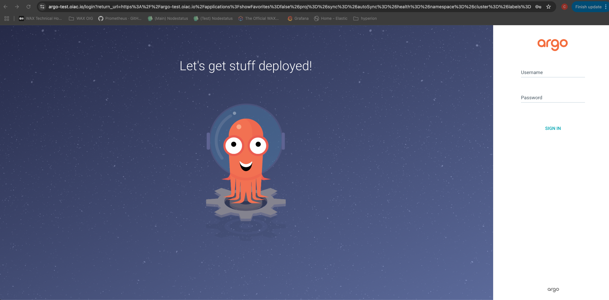
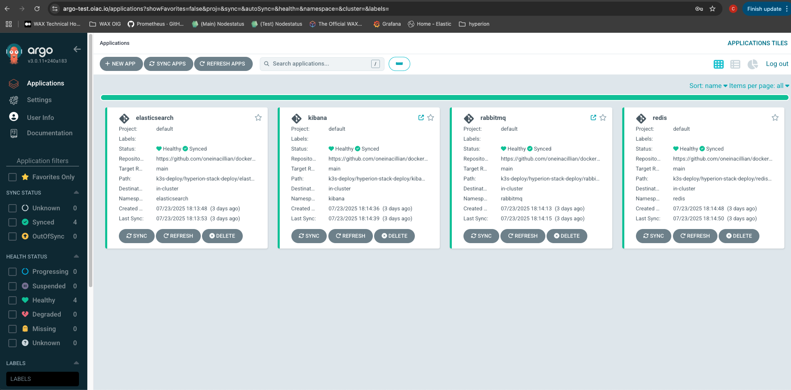

# 🚀 ArgoCD Deployment

Easily deploy ArgoCD to your K3s cluster using the provided `deploy.sh` script.

## Quickstart

```sh
cd k3s-deploy/argo-deploy
./deploy.sh
```

- Installs ArgoCD with Ingress and TLS
- Outputs the initial admin password for login

## Access

- **ArgoCD UI:** https://<your-argo-domain>

## Screenshots




> For more details, see the [main deployment guide](../hyperion-stack-deploy/README.md).