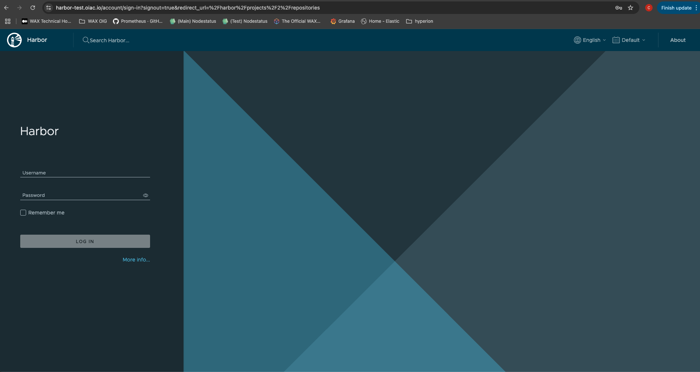
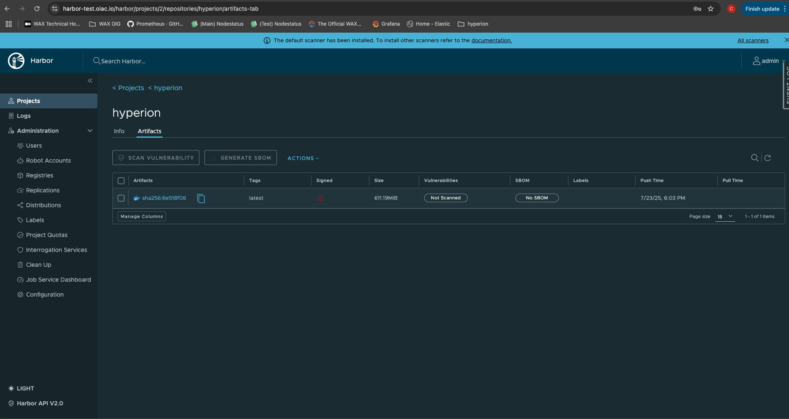

# 🐳 Harbor Deployment

Deploy Harbor as your private container registry with a single script.

## Quickstart

```sh
cd k3s-deploy/harbor-deploy
./deploy.sh
```

- Installs Harbor with Ingress and TLS
- Sets the admin password

## Access

- **Harbor UI:** https://<your-harbor-domain>

## Screenshots




> For more details, see the [main deployment guide](../hyperion-stack-deploy/README.md).