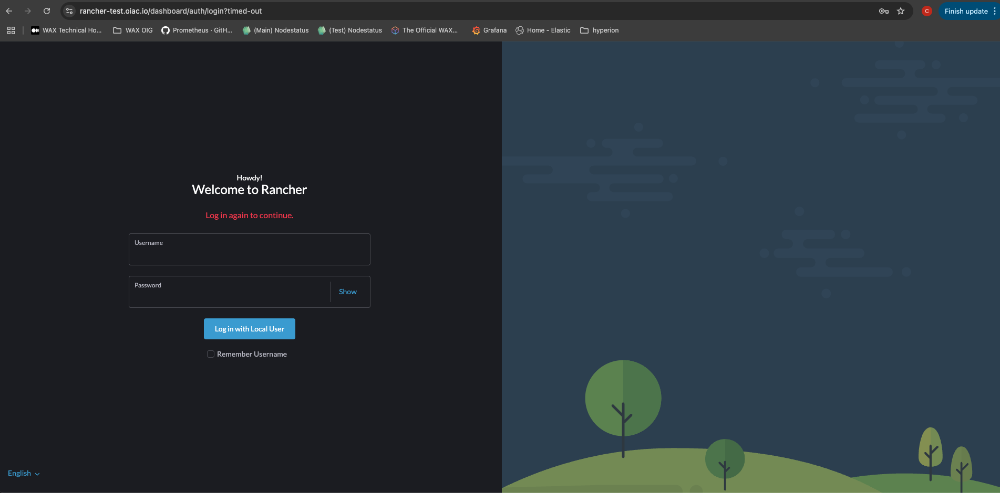
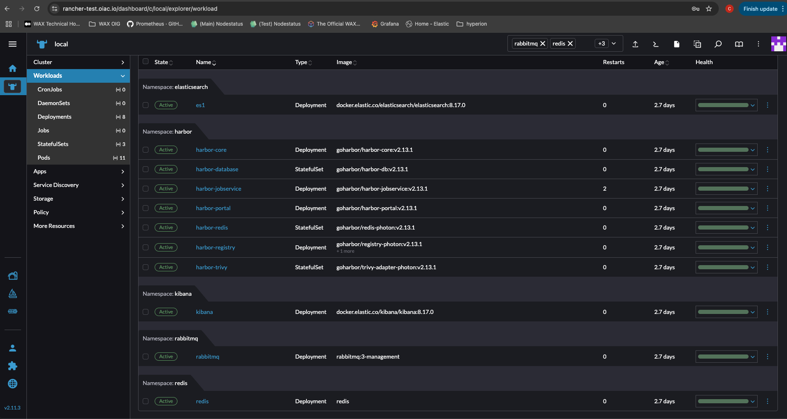

# 🐮 Rancher Deployment

Deploy Rancher for cluster management with a single script.

## Quickstart

```sh
cd k3s-deploy/rancher-deploy
./deploy.sh
```

- Installs Rancher with Ingress and TLS
- Sets up the admin interface

## Access

- **Rancher UI:** https://<your-rancher-domain>

## Screenshots




> For more details, see the [main deployment guide](../hyperion-stack-deploy/README.md).